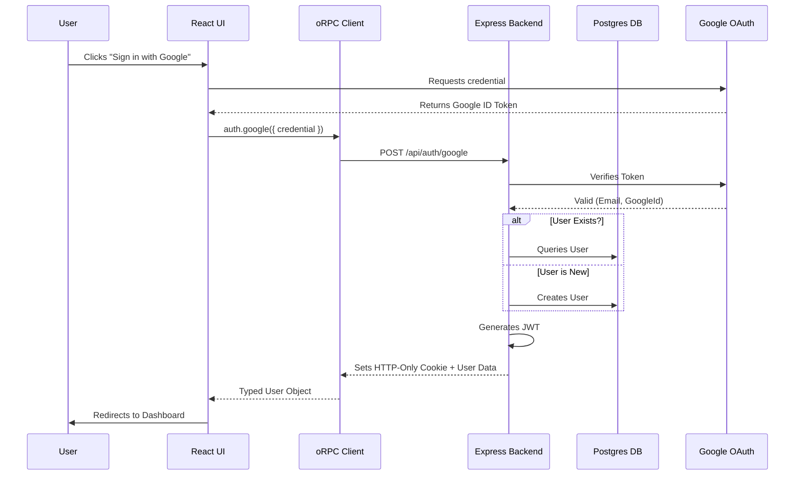
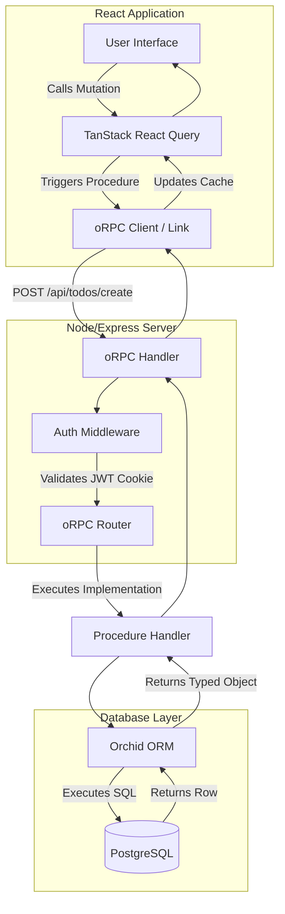
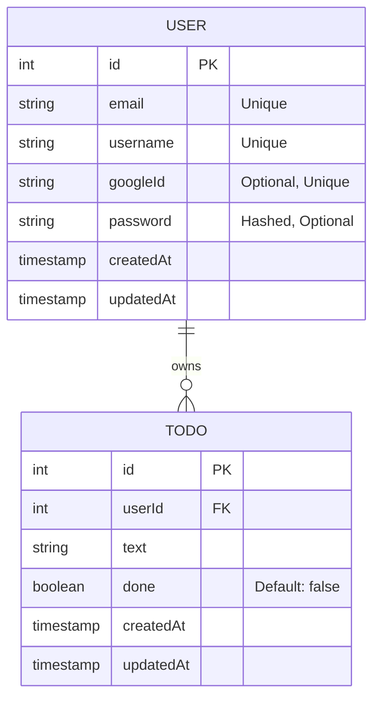

# System Architecture & Flows

This document outlines the core architecture and data flows of the ToDo application, highlighting our **Contract-First** approach using **oRPC** and **TanStack React Query**.

## 1. Contract-First Architecture
The foundation of the application is the **Shared Contract**. Instead of defining separate types for frontend and backend, we define a single source of truth.

- **The Contract (`contract.ts`):** Defines all procedures (API calls), their inputs (validated by Zod), and their outputs.
- **The Router (`router.ts`):** The backend implements these procedures. TypeScript ensures the implementation matches the contract.
- **The Client (`orpc.ts`):** The frontend generates a typed client from the contract. No manual fetching or type casting is required.

## 2. Authentication Flow (oRPC + JWT)
The application leverages Google OAuth for identity and issues JWTs stored in HTTP-only cookies.

## 3. End-to-End Data Flow (React Query + oRPC)
This diagram shows how a "Create ToDo" action travels from the UI through React Query and oRPC to the database.

## 4. Database Schema
Managed via Orchid ORM.

## 5. Progressive Web App (PWA) Architecture
Powered by `vite-plugin-pwa`.

- **Service Worker:** Automatically generated to cache the application shell and assets for rapid loading and offline resilience.
- **Web App Manifest:** Provides metadata (`TodoFlow`, icons, `standalone` mode) for device installation.
