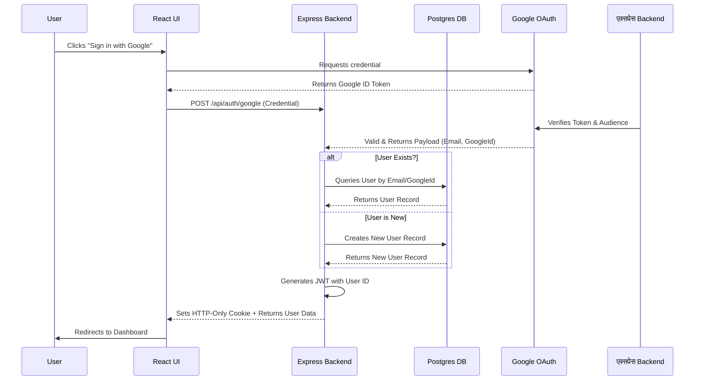
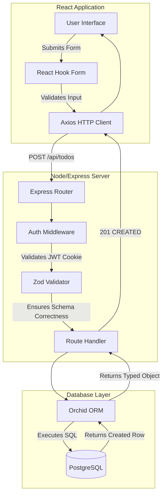
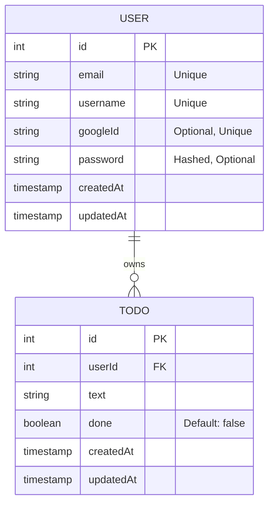

# System Architecture & Flows

This document outlines the core architecture and data flows of the ToDo application. These diagrams are designed to help new contributors and reviewers quickly understand the system's interactions.

## 1. Authentication Flow (Google OAuth & JWT)
The application leverages Google OAuth for identity verification and issues its own JWTs stored in HTTP-only cookies for session management.

## 2. End-to-End Data Flow (Creating a Task)
This diagram illustrates how data flows from the client to the database when a user performs a standard action, such as creating a new ToDo.

## 3. Database Schema
The database is managed via Orchid ORM. The relational structure is straightforward, focusing on Users and their associated ToDos.

## 4. Progressive Web App (PWA) Architecture
The frontend is configured as a Progressive Web Application via `vite-plugin-pwa`.

- **Service Worker (`autoUpdate`):** Automatically generated by Workbox within the Vite build process. It caches the application shell (HTML, bundled JavaScript/CSS, and static assets) to ensure rapid subsequent page loads and provide basic offline shell resilience.
- **Web App Manifest:** Serves the metadata (such as the app name `TodoFlow`, UI icons, and `standalone` display mode) which triggers browser prompts enabling users to install the application directly to their device's home screen or desktop.
    }